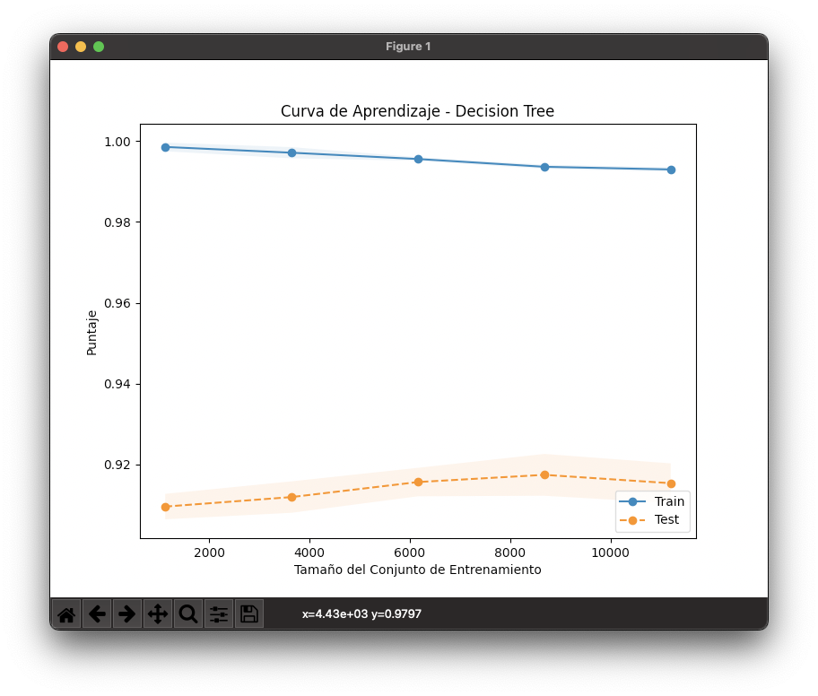
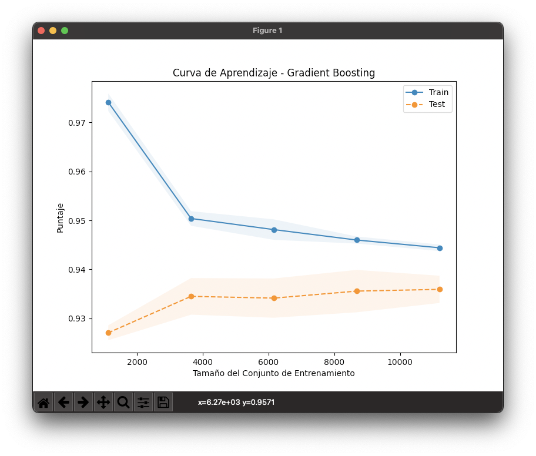
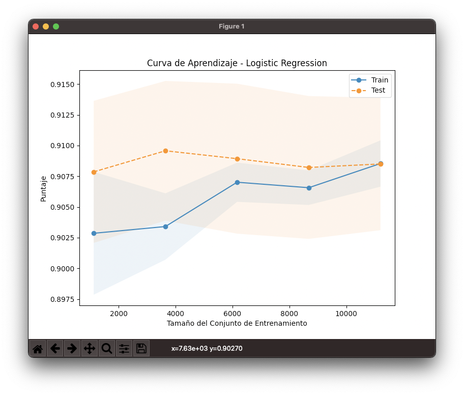
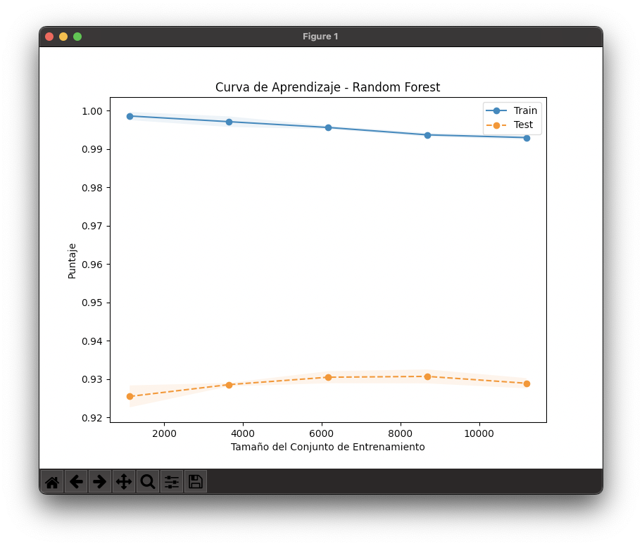

# Análisis de Curvas de Aprendizaje

Este proyecto utiliza cuatro modelos de clasificación diferentes para predecir la aprobación o el rechazo de préstamos basados en los datos del solicitante. Los modelos empleados son:

1. **Regresión Logística**
2. **Árbol de Decisión**
3. **Random Forest**
4. **Gradient Boosting**

Cada uno de estos modelos se evaluó utilizando una curva de aprendizaje, que ilustra el rendimiento del modelo en función del tamaño del conjunto de entrenamiento. En este archivo `README`, se proporciona una interpretación de las curvas de aprendizaje generadas para estos modelos.

## Modelos Utilizados

### 1. **Árbol de Decisión**

#### Interpretación:

- **Curva de Entrenamiento**: La línea azul muestra que el modelo de árbol de decisión tiene una precisión muy alta (~100%) en el conjunto de entrenamiento, lo que indica que está ajustando perfectamente los datos de entrenamiento.
- **Curva de Prueba**: La línea naranja muestra que la precisión en el conjunto de prueba es considerablemente menor (~92%).
- **Conclusión**: Esto indica un claro **sobreajuste** (overfitting). El modelo se adapta demasiado a los datos de entrenamiento y no generaliza bien en nuevos datos. Para mejorar esto, sería recomendable podar el árbol o ajustar algunos hiperparámetros como la profundidad máxima del árbol.

### 2. **Gradient Boosting**

#### Interpretación:

- **Curva de Entrenamiento**: La precisión en el conjunto de entrenamiento es alta (~98%), pero no alcanza el 100%, lo que indica que el modelo no está completamente sobreajustado.
- **Curva de Prueba**: La precisión en el conjunto de prueba es similar a la del entrenamiento (~92-93%), lo que indica una buena capacidad de generalización.
- **Conclusión**: El modelo de **Gradient Boosting** parece estar funcionando bien, logrando un buen equilibrio entre ajuste y generalización. Es menos probable que esté sobreajustado en comparación con el modelo de árbol de decisión.

### 3. **Regresión Logística**

#### Interpretación:

- **Curva de Entrenamiento**: La precisión en el conjunto de entrenamiento mejora gradualmente, pero nunca alcanza valores muy altos, quedándose alrededor del 90.25%.
- **Curva de Prueba**: La precisión en el conjunto de prueba es también alrededor del 90.75%.
- **Conclusión**: El modelo de **Regresión Logística** muestra un rendimiento bastante consistente entre los conjuntos de entrenamiento y prueba, lo que indica que el modelo está generalizando bien y no está sobreajustado. Es un buen modelo de base, aunque podría no captar las relaciones más complejas en los datos.

### 4. **Random Forest**

#### Interpretación:

- **Curva de Entrenamiento**: La precisión del conjunto de entrenamiento es muy alta (~99-100%).
- **Curva de Prueba**: La precisión en el conjunto de prueba es significativamente más baja (~92%), pero se mantiene estable.
- **Conclusión**: Al igual que el árbol de decisión, **Random Forest** también muestra un cierto grado de sobreajuste, aunque no tan extremo. Random Forest tiende a mejorar la capacidad de generalización en comparación con los árboles de decisión individuales, pero todavía hay margen de mejora en la diferencia entre las curvas de entrenamiento y prueba.

---

## Conclusión General

- **Regresión Logística**: Buen rendimiento con poca o ninguna señal de sobreajuste. Funciona bien en problemas lineales.
- **Árbol de Decisión**: El modelo está claramente sobreajustado y necesita una mayor regularización o poda.
- **Random Forest**: Mejora en la capacidad de generalización respecto a los árboles de decisión, pero aún muestra signos de sobreajuste.
- **Gradient Boosting**: Presenta el mejor equilibrio entre ajuste y generalización, siendo el modelo más efectivo en términos de rendimiento.

## Recomendaciones

- **Regresión Logística** es una opción segura y simple cuando las relaciones entre las variables son lineales.
- **Gradient Boosting** es probablemente la mejor opción cuando se desea un modelo que generalice bien y capture relaciones no lineales entre las variables.
- Si se usa **Árbol de Decisión** o **Random Forest**, es recomendable ajustar sus hiperparámetros para reducir el sobreajuste, como la profundidad máxima o el número mínimo de muestras en las hojas.
